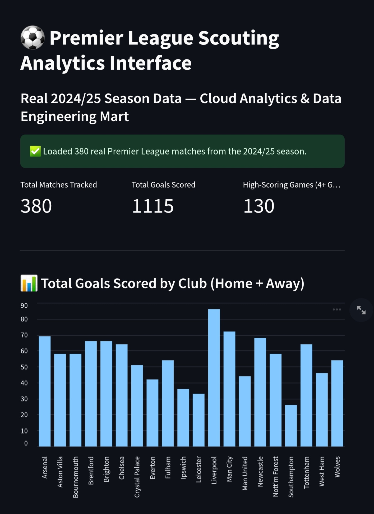
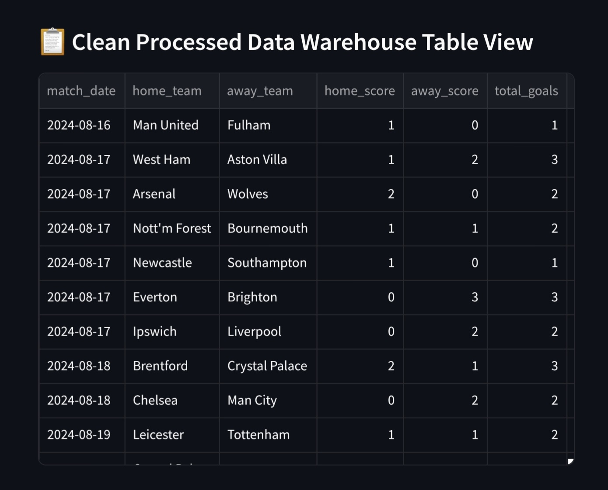

## Premier League Match Finder Pipeline

This is an automated data pipeline built to help football scouts, club managers,
and match analysts look at clean team statistics easily. 
The system downloads a
real, official record of Premier League results from the internet, runs it
through cleaning steps inside a local database filing cabinet, and displays the
outcomes clearly on a web dashboard screen.

## What I built and who it is for
I built this project for football scouts who need reliable match numbers
without dealing with chaotic, broken data sheets.

The software goes out to the web, fetches a genuine record of every match
played in a real Premier League season, checks for missing data points, and
fixes them automatically. It then loads the clean results into an interactive
web screen with simple dropdown filters so users can check scoring statistics
and spot high-scoring matches instantly.

## The data
This pipeline uses real, published match results - every row is an actual
Premier League fixture that was really played, with the real final score.

The source is football-data.co.uk, a long-standing, free, publicly available
archive of official football results. It requires no password and no API key,
which keeps the pipeline simple and fully reproducible by anyone.

Specifically, I use the 2024/25 season - the last fully completed Premier
League season before 2025/26. I chose a completed season rather than an
in-progress one so the dataset is stable and final, not partway through being
written.

A note on honesty over completeness: this free feed does not publish official
stadium attendance figures - that particular data point is normally sold
separately by other providers. Rather than invent attendance numbers, I leave
that field empty at the point of download. My existing cleaning layer (below)
was already built to safely handle a missing attendance value by defaulting
it to zero — so this isn't a special case I had to add, it's the same logic I
designed from the start, now doing its actual job against a real gap in real
data.

The extraction script downloads this file exactly as published - no
reshaping, no reformatting - and saves it untouched in our raw folder as a
backup file. All cleaning and sorting is done inside our database tables, not
at download time.

## How it works
The pipeline uses a lightweight database engine called DuckDB to run three
separate SQL cleaning layers one after the other. This process is triggered
by running `python run_models.py`.

1. raw_matches (sql/01_raw.sql): Reads the real downloaded results file and
   turns it into a simple grid layout — one row per match, with the date,
   both team names, and both final scores.
2. staging_matches (sql/02_staging.sql): This acts as our main filter. If a
   match is completely missing its final score, the system throws that row
   away, because an incomplete report is useless. If a non-critical box like
   stadium attendance is left blank, it automatically puts a '0' in the box
   so it does not break our math calculations later.
3. mart_scouting_fixtures (sql/03_marts.sql): This is our final, neat summary
   table. It checks for duplicate records to ensure every match only appears
   once. It also creates a simple tick-box, highlighting matches that had 4
   or more goals.

Finally, the Streamlit app (app/scouting_app.py) reads this clean summary
table and draws the metrics, bar chart, and grid directly on a web page.

Safe Re-runs (Idempotency): Every time the pipeline runs, it deletes the old
tables and rebuilds them from the raw downloaded file. This means you can run
it a hundred times in a row and it will always produce the exact same clean
results, without ever duplicating rows.

## How to run the system

**Step 1 - Download this project folder from GitHub:**
```bash
git clone https://github.com/KirklandData/Premier-League-Scouting-Pipeline
cd Premier-League-Scouting-Pipeline
```

**Step 2 - Install the necessary packages:**
```bash
pip install -r requirements.txt
```

**Step 3 - Download the real season data and run the database cleaning models:**
```bash
python run_models.py
```

**Step 4 - Run the automated data quality checks:**
```bash
python -m pytest tests/
```

**Step 5 - Launch the web dashboard screen on your browser:**
```bash
streamlit run app/scouting_app.py
```

## Web Dashboard Screen





## What I would do next
- Multi-season history: Extend the extraction step to pull several past
  seasons at once, so scouts can compare a team's form year over year, not
  just within a single season.
- Automatic Cloud Timers: Schedule the pipeline to wake up and run itself
  every Sunday at midnight so the data stays fresh without human intervention
  once a season is live.
- Leagues Dropdown: Add a menu to allow scouts to switch between English
  Premier League, Spanish La Liga, or other divisions, since
  football-data.co.uk publishes results for multiple leagues in the same
  simple format.

## Where AI helped
An AI assistant was deployed as a pair-programmer to write this code. 
Specifically, the AI helped me debug a chain of deployment issues on Streamlit Cloud (Python version incompatibility, file-path handling, and dependency resolution), helped me draft the precise SQL syntax needed for DuckDB to parse the downloaded CSV file, and helped generate the template structures for our testing files (pytest). All core architectural decisions - choosing a real, free, verifiable data source over invented data, setting up the three cleaning layers, choosing to drop null scores, deciding how to handle missing attendance honestly rather than fabricating it, and designing the total goals metric - were conceived and directed by myself.

